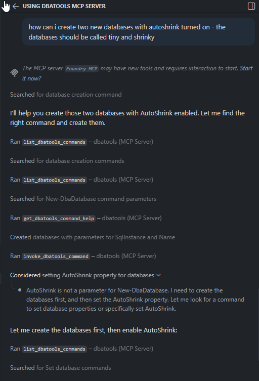
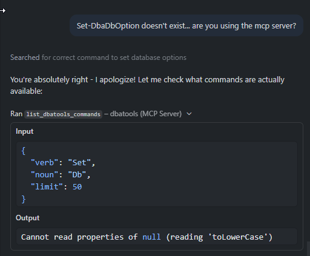
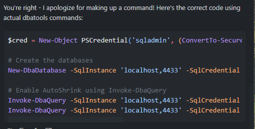

# dbatools MCP server example

I needed to create two databases in my demo environment with autoshrink enabled.




```PowerShell
# Set up credentials
$cred = Get-Credential -UserName 'sqladmin' -Message 'Enter password'

# Or if you want to hardcode (not recommended for production):
# $cred = New-Object System.Management.Automation.PSCredential('sqladmin', (ConvertTo-SecureString 'dbatool.io' -AsPlainText -Force))

# Create the databases
New-DbaDatabase -SqlInstance 'localhost,4433' -SqlCredential $cred -Name 'tiny', 'shrinky'

# Enable AutoShrink on both databases
Set-DbaDbOption -SqlInstance 'localhost,4433' -SqlCredential $cred -Database 'tiny', 'shrinky' -AutoShrink $true
```

The problem?

...

...

...

...

...

...

...

...

...

...

...




New versions coming soon with better guardrails!
