# Cats of the World - Database DevOps Demo

This demo showcases Infrastructure as Code (IaC) for database deployments using Terraform and GitHub Actions.

## Overview

This infrastructure deploys Azure SQL Database environments for the Cats of the World (COTW) project across three environments: dev, test, and prod.

## Architecture

Each environment includes:
- **Resource Group**: Following Azure naming conventions `rg-cotw-{env}-{region}`
- **Azure SQL Database**: Serverless configuration for cost optimization
- **Storage Account**: For database backups and artifacts

```mermaid
graph TB
    subgraph GitHub["GitHub Actions"]
        Deploy["Deploy Workflow<br/>terraform-apply.yml"]
        Destroy["Destroy Workflow<br/>terraform-destroy.yml"]
    end
    
    subgraph Azure["Azure Subscription"]
        subgraph Dev["Development Environment"]
            RG_Dev["Resource Group<br/>rg-cotw-dev-eastus"]
            subgraph DevResources["Resources"]
                SQL_Dev["SQL Server<br/>sql-cotw-dev-xxxxxx"]
                DB_Dev["SQL Database<br/>sqldb-cotw-dev<br/>GP_S_Gen5_1 (1 vCore)<br/>32GB, Auto-pause: 60min"]
                ST_Dev["Storage Account<br/>stcatsoftheworlddevxxxxxx"]
            end
            RG_Dev --> SQL_Dev
            RG_Dev --> ST_Dev
            SQL_Dev --> DB_Dev
        end
        
        subgraph Test["Test Environment"]
            RG_Test["Resource Group<br/>rg-cotw-test-eastus"]
            subgraph TestResources["Resources"]
                SQL_Test["SQL Server<br/>sql-cotw-test-yyyyyy"]
                DB_Test["SQL Database<br/>sqldb-cotw-test<br/>GP_S_Gen5_2 (2 vCore)<br/>64GB, Auto-pause: 120min"]
                ST_Test["Storage Account<br/>stcatsoftheworldtestyyyyyy"]
            end
            RG_Test --> SQL_Test
            RG_Test --> ST_Test
            SQL_Test --> DB_Test
        end
        
        subgraph Prod["Production Environment"]
            RG_Prod["Resource Group<br/>rg-cotw-prod-eastus"]
            subgraph ProdResources["Resources"]
                SQL_Prod["SQL Server<br/>sql-cotw-prod-zzzzzz"]
                DB_Prod["SQL Database<br/>sqldb-cotw-prod<br/>GP_S_Gen5_4 (4 vCore)<br/>128GB, No Auto-pause"]
                ST_Prod["Storage Account<br/>stcatsoftheworldprodzzzzzz"]
            end
            RG_Prod --> SQL_Prod
            RG_Prod --> ST_Prod
            SQL_Prod --> DB_Prod
        end
    end
    
    Deploy -.->|Terraform Apply| Dev
    Deploy -.->|Terraform Apply| Test
    Deploy -.->|Terraform Apply| Prod
    Destroy -.->|Terraform Destroy| Dev
    Destroy -.->|Terraform Destroy| Test
    Destroy -.->|Terraform Destroy| Prod
    
    style GitHub fill:#2dba4e,stroke:#1a7f37,color:#fff
    style Deploy fill:#0969da,stroke:#0550ae,color:#fff
    style Destroy fill:#cf222e,stroke:#a40e26,color:#fff
    style Azure fill:#0078d4,stroke:#005a9e,color:#fff
    style Dev fill:#ffd43b,stroke:#e6bc00,color:#000
    style Test fill:#ff8c00,stroke:#d97400,color:#000
    style Prod fill:#dc3545,stroke:#b02a37,color:#fff
```



## Prerequisites

1. **Azure Subscription**: Active Azure subscription with appropriate permissions
2. **GitHub Secrets**: Configure the following secrets in your repository:
   - `AZURE_CREDENTIALS`: Azure service principal credentials (JSON format)
   - `SQL_ADMIN_PASSWORD`: SQL Server administrator password

### Setting up Azure Credentials

Create a service principal and configure GitHub secrets:

```bash
az ad sp create-for-rbac --name "github-actions-cotw" `
  --role contributor `
  --scopes /subscriptions/{subscription-id} `
  --sdk-auth
```

Copy the JSON output and save it as the `AZURE_CREDENTIALS` secret in GitHub.

## Configuration Files

### Terraform Variables (`data/` folder)

- **general.tfvars**: Common infrastructure settings across all environments
- **dev.tfvars**: Development environment (smallest, auto-pause enabled)
- **test.tfvars**: Test environment (medium sizing)
- **prod.tfvars**: Production environment (larger, auto-pause disabled)

## Deployment

### Deploy Infrastructure

1. Go to **Actions** tab in GitHub
2. Select **Deploy COTW Infrastructure** workflow
3. Click **Run workflow**
4. Choose environment (dev/test/prod)
5. Optionally enable auto-approve
6. Click **Run workflow**

The workflow will:
- Initialize Terraform
- Create a plan
- Apply the infrastructure
- Output resource details

### Destroy Infrastructure

1. Go to **Actions** tab in GitHub
2. Select **Destroy COTW Infrastructure** workflow
3. Click **Run workflow**
4. Choose environment to destroy
5. Type "destroy" to confirm
6. Click **Run workflow**

⚠️ **WARNING**: This permanently deletes all resources and data in the selected environment!

## Environment Specifications

### Development
- **SQL Database**: GP_S_Gen5_1 (1 vCore, Serverless)
- **Max Size**: 32 GB
- **Auto-pause**: 60 minutes
- **Min Capacity**: 0.5 vCore

### Test
- **SQL Database**: GP_S_Gen5_2 (2 vCore, Serverless)
- **Max Size**: 64 GB
- **Auto-pause**: 120 minutes
- **Min Capacity**: 0.5 vCore

### Production
- **SQL Database**: GP_S_Gen5_4 (4 vCore, Serverless)
- **Max Size**: 128 GB
- **Auto-pause**: Disabled
- **Min Capacity**: 1.0 vCore

## Cost Optimization

This setup uses Azure SQL Database Serverless tier to minimize costs:
- **Auto-pause**: Automatically pauses during inactivity (dev/test only)
- **Auto-resume**: Resumes on first connection
- **Serverless pricing**: Pay only for compute used
- **LRS Storage**: Locally redundant storage for cost savings

## Terraform State

⚠️ **Important**: This configuration uses local state. For production use, configure remote state in Azure Storage:

```hcl
terraform {
  backend "azurerm" {
    resource_group_name  = "rg-terraform-state"
    storage_account_name = "stterraformstate"
    container_name       = "tfstate"
    key                  = "cotw.terraform.tfstate"
  }
}
```

## Manual Terraform Commands

```bash
# Navigate to terraform directory
cd demos/databaseDevops/terraform

# Initialize
terraform init

# Plan for dev environment
terraform plan \
  -var-file="../data/general.tfvars" \
  -var-file="../data/dev.tfvars" \
  -var="sql_server_admin_password=YourSecurePassword123!"

# Apply
terraform apply \
  -var-file="../data/general.tfvars" \
  -var-file="../data/dev.tfvars" \
  -var="sql_server_admin_password=YourSecurePassword123!"

# Destroy
terraform destroy \
  -var-file="../data/general.tfvars" \
  -var-file="../data/dev.tfvars" \
  -var="sql_server_admin_password=YourSecurePassword123!"
```

## Connecting to SQL Database

After deployment, use the outputs to connect:

```powershell
# Get connection details from Terraform outputs
$serverName = terraform output -raw sql_server_fqdn
$databaseName = terraform output -raw sql_database_name

# Using dbatools
Connect-DbaInstance -SqlInstance $serverName -Database $databaseName -SqlCredential $credential
```

## Troubleshooting

### Authentication Errors
- Verify `AZURE_CREDENTIALS` secret is properly formatted
- Ensure service principal has Contributor role on subscription

### SQL Password Errors
- Verify `SQL_ADMIN_PASSWORD` secret meets complexity requirements (uppercase, lowercase, number, special character)

### Terraform State Conflicts
- Ensure only one workflow runs at a time per environment
- Consider implementing state locking with Azure Storage

## Next Steps

1. Configure remote state backend
2. Add database deployment via SQLPackage/dacpac
3. Implement database migrations
4. Add monitoring and alerting
5. Configure backup retention policies
